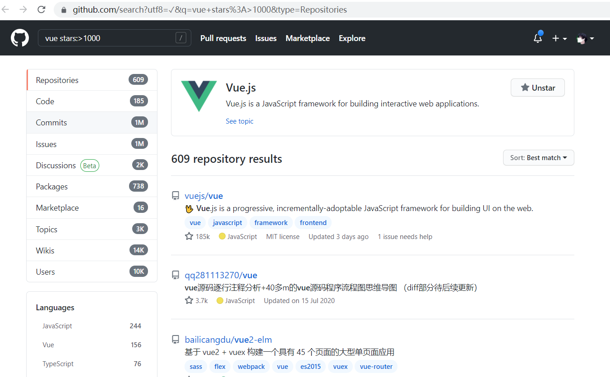
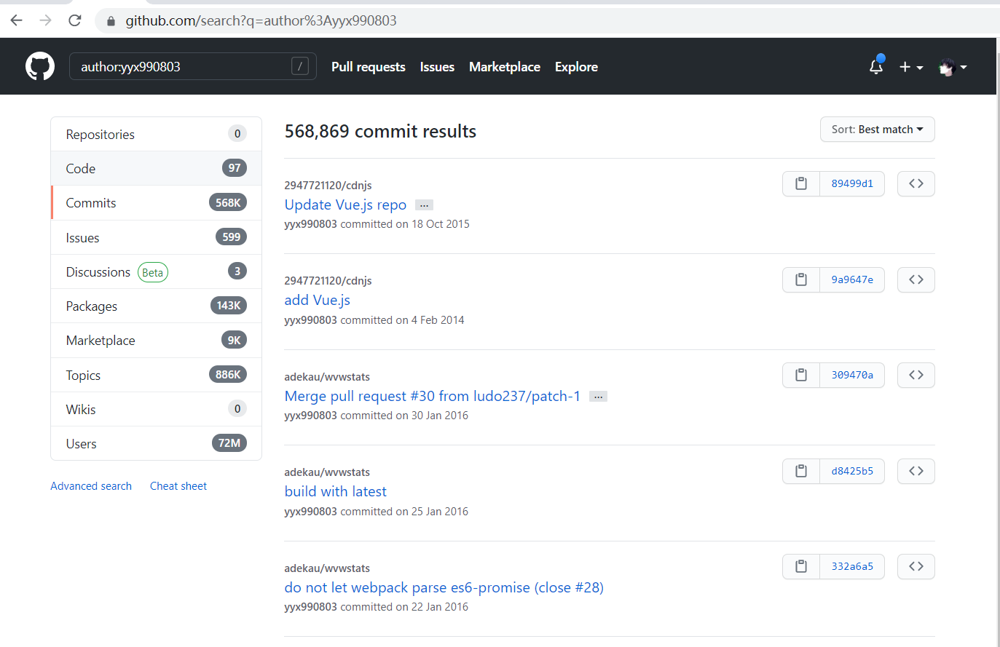

# github使用技巧
## 1.1 普通的搜索
- 直接搜索技术栈相关的项目  
- 一般主要用到三个功能，查询/选语言/排序


## 1.2 github搜索功能仅仅如此？

- 查询vue且star大于1000的仓库
```js
// 写法一
vue stars:>1000 language:javascript
// 写法二
vue stars:1000..*
// 查询范围
vue stars:1000..10000
```



- 查询vue且topics大于20的仓库
```js
vue topics:>=20
```

- 通过日期查询
```js
// >=*YYYY*-*MM*-*DD*
vue created:>=2021-06-18  // 2021-06-18创建的项目
```

- 使用用户名的查询
```js
// Evan You
author:yyx990803

```


## 2.1 高级的搜索
按仓库名称、说明或自述文件内容搜索

- 仓库名称，说明，自述内容含有vue的仓库
```js
vue-next in:name,description,readme  
```

- 匹配指定用户的blog仓库??
```js
repo:alan89757/blog
```
- 在用户或组织的仓库内搜索
```js
user:yyx990803 forks:>=100  
```
```js
org:github 
```
- 按关注者数量搜索
```js
vue followers:>=10000
```

- 按forks数量搜索
```js
vue forks:10000
```

- 按主题搜索
```js
topic:koa
```

- 按许可搜索
```js
license:MIT License
```