# http协议
<!-- ## 1.先提几个问题
### （1）http请求数据格式？
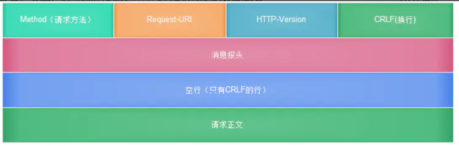
### （2）http与https有什么区别？
https://mp.weixin.qq.com/s/GICbiyJpINrHZ41u_4zT-A?

### （3）客户端和服务器是如何实现加密传输的？
证书 + 密钥 -->

### 分为三部分讲解General，Request Headers, Response Headers

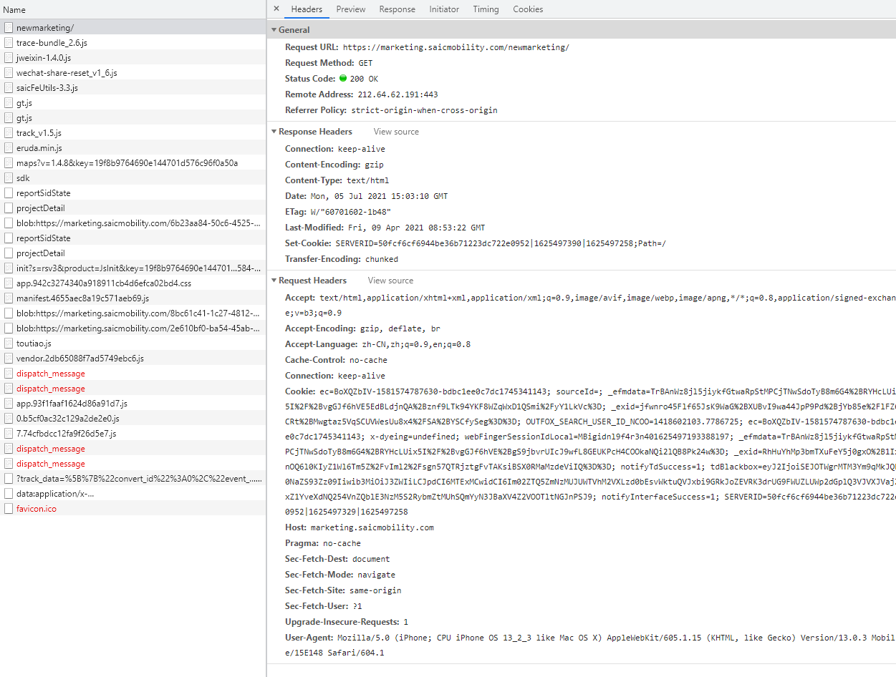

## 1. General
```html
// 先看一个请求案例
https://marketing.saicmobility.com/newmarketing/#/login
```

- Request URL 请求地址，
问：http/https默认请求端口多少??
<!-- http://xxx.com:80  https://xxx.com:443 -->

- Request Method  请求方法
- HTTP有哪些Method???
<!-- ```text
GET/POST/PUT/PATCH/DELETE/HEAD/OPTIONS等等
``` -->

- get与post对比


- 常见问题：
  - GET 方法参数写法是固定的吗？
不固定，流行写法：`http://www.example.com/user/name/chengqm/age/22`
  - POST 方法比 GET 方法安全？
<!-- 都不安全，https才是安全传输 -->
  - GET 方法的长度限制是怎么回事？谁限制的？
<!-- 浏览器和服务器限制，防止恶意构造长url攻击 -->

  - get与post还有哪些其他区别???
<!-- 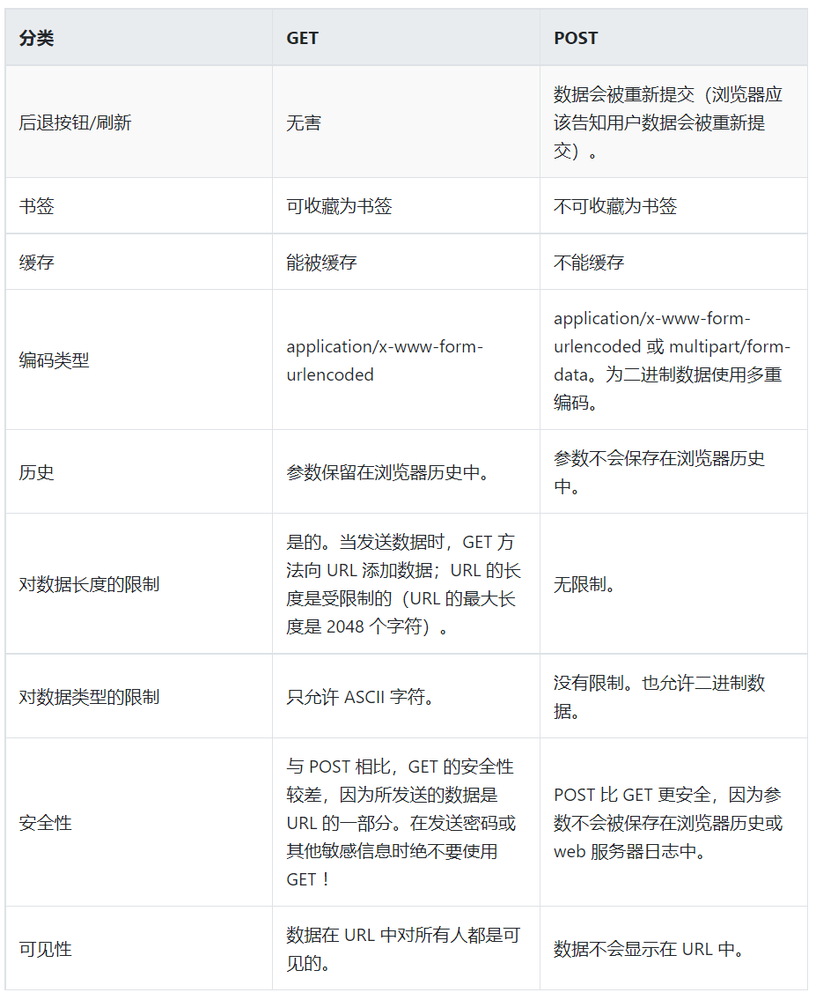 -->

- Status Code
状态码
  - 常见状态码有哪些???
<!-- ```text
200： OK - 客户端请求成功
400： Bad Request - 客户端请求有语法错误，不能被服务器所理解
401： Unauthorized - 请求未经授权，这个状态代码必须和WWW-Authenticate报头域一起使用
403： Forbidden - 服务器收到请求，但是拒绝提供服务
404： Not Found - 请求资源不存在，eg：输入了错误的URL
500： Internal Server Error - 服务器发生不可预期的错误
503： Server Unavailable - 服务器当前不能处理客户端的请求，一段时间后,可能恢复正常
``` -->
  - http状态响应类别
```text
  1xx：指示信息 - 表示请求已接收，继续处理
  2xx：成功 - 表示请求已被成功接收、理解、接受
  3xx：重定向 - 要完成请求必须进行更进一步的操作
  4xx：客户端错误 - 请求有语法错误或请求无法实现
  5xx：服务器端错误 - 服务器未能实现合法的请求
```

- Remote Address  服务器地址

- Referrer Policy  控制请求头中referrer的内容，目前是一个候选标准，不过已经有部分浏览器支持该标准。 

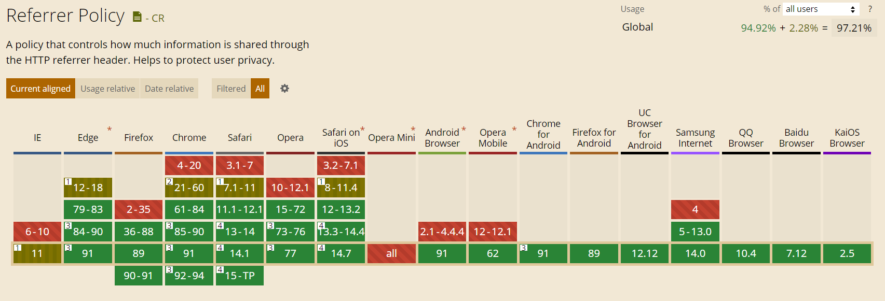

## 2. Request Headers


```text
Accept: 能正确接收的媒体类型：application/json text/plain
Accept-Encoding: 能正确接收的字符集: unicode-1-1
Accept-Language:能正确接收的语言列表：zh-cn,zh;1=0.9,en,1=0.8
Connection:浏览器想要优先使用的连接类型： keep-alive close（开启和关闭持久连接）
Content-Length:request body 长度（即实体主体的大小）：
Content-Type: 内容的媒体类型（如'application/json;charset=UTF-8'则会发送预检请求）
Host:服务器的域名，用于区分单台服务器多个域名的虚拟主机，是HTTP/1.1唯一必须包含的字段。
Origin: 请求源
Referer:请求发起页面的原始URI
User-Agent: 客户端信息
Authorization：客户端认证信息：Bearer dSdSdFFlsfdjasd123，一般存token用
Pragma:客户端要求中间服务器不返回缓存的资源
Cookie：发送给服务器的Cookie信息
If-Modified-Since：本地资源未修改返回 304（比较时间）
If-None-Match：	本地资源未修改返回 304（比较标记）
Cache-Control：控制缓存的行为：no-cache（强制向服务器再次验证）、no-store（不做任何缓存）、
max-age=111111（资源可缓存最大时间 秒）、public（客户端、代理服务器都可利用缓存）、private（代理服务器不可用缓存）
```

- Accept-Encoding把gzip修改为identity  
  
|
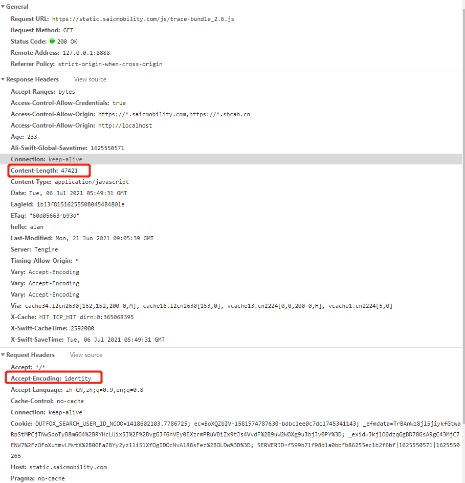

## 3. Response Headers
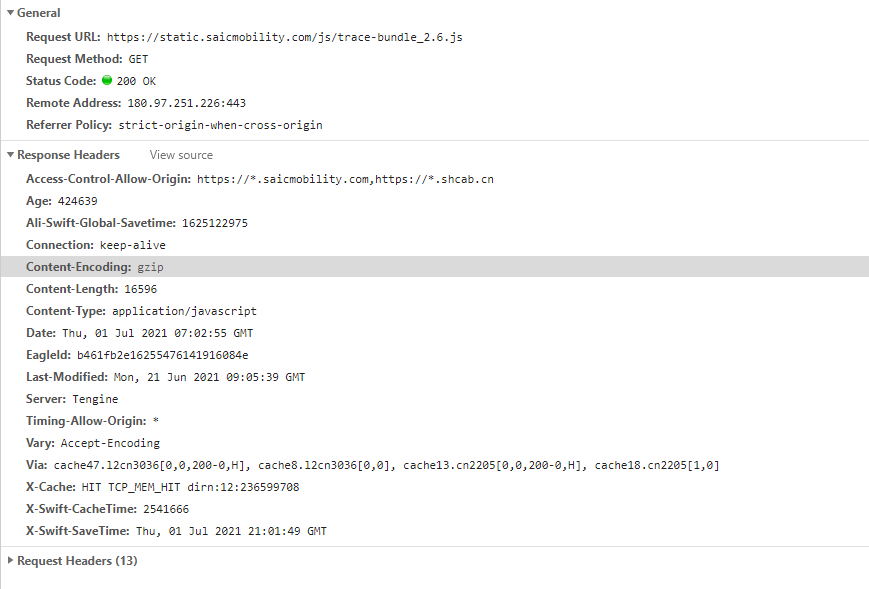

```text
Access-Control-Allow-Origin: https://*.saicmobility.com,https://*.shcab.cn
Connection: keep-alive // 优先使用的连接类型
Content-Encoding: gzip    // 编码格式
Content-Type: text/html   // 媒体类型
Date: Tue, 06 Jul 2021 05:00:14 GMT // 创建报文时间
ETag: W/"60701602-1b48"   // 资源标识
Last-Modified: Fri, 09 Apr 2021 08:53:22 GMT //最后更新时间（格林威治时间）
Set-Cookie: SERVERID=1ad1b725f19099514ac313a5ec32bff6|1625547614|1625547399;Path=/    // 服务端设置cookie
Transfer-Encoding: chunked  // 传输编码方式：chunked分块传输
Via: cache47.l2cn3036[0,0,200-0,H], cache8.l2cn3036[0,0], cache13.cn2205[0,0,304-0,H], cache16.cn2205[1,0]  
// 代理服务器相关信息，每经过一个代理服务器就会添加相关信息，用逗号分割
Server: Tengine  // nginx升级版
```

- Content-Type把text/html修改为text/javascript
  
  

- 常用的http版本  
常用版本：HTTP1.0、HTTP1.1 、 HTTP2.0 和 HTTP3.0
  - 浏览器兼容对比  
    1.1 HTTP1.0，HTTP1.1浏览器基本都支持

  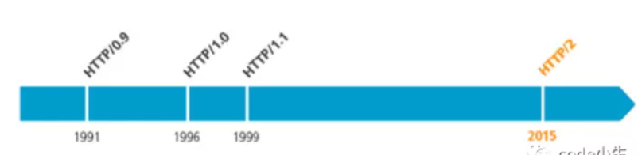

    1.2 HTTP 2.0  

  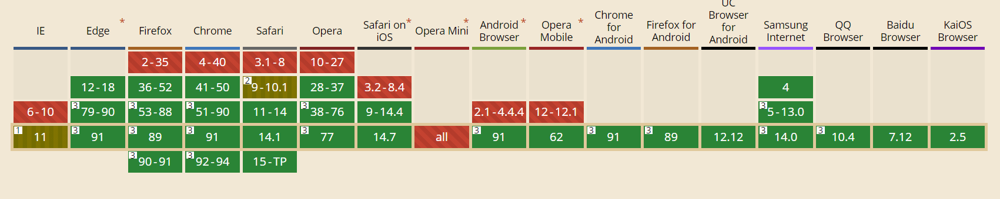

    1.3 HTTP 3.0  

  

```text
  以上数据来自https://caniuse.com/，仅供参考
```

## 4. 应用
### 4.1 缓存


- 为什么需要缓存???
<!-- 1.冗余的数据传输 2.带宽瓶颈 3.瞬间拥塞 4.距离时延 -->
- 哪些内容适合缓存???
<!-- 考虑缓存的内容：
css样式文件
js文件
logo、图标
html文件
可以下载的内容 -->

4.1.1. 缓存的命中和未命中
  - 缓存命中
  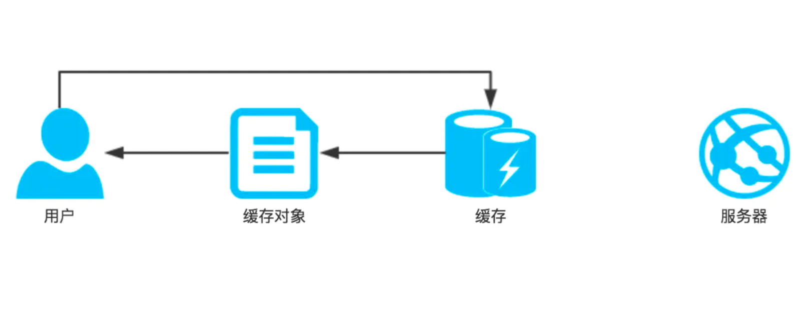  

  - 缓存未命中
  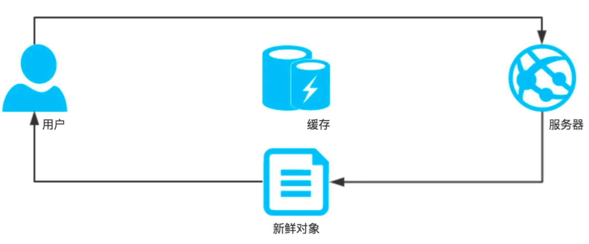
4.1.2. 强缓存
   ```html
    Cache-Control: max-age=30  // 最大一年31536000， 常用于不会经常变化的文本（如CDN）
    Expires: Tue, 06 Jul 2022 05:49:31 GMT
    Cache-Control: no-cache  // 每次请求都会去服务器确认是否更新
    Cache-Control: no-store  // 不使用任何缓存
    Cache-Control: max-age=60   // 60s后会去服务器确认是否更新
    Cache-Control: must-revalidate // 必须去验证服务器验证，验证失败返回504
   ```
4.1.3. 协商缓存
  ```html
    // response Header
    ETag: W/"60701602-1b48"   // 资源标识
    Last-Modified: Fri, 09 Apr 2021 08:53:22 GMT //最后更新时间（格林威治时间）
    //  request Header
    If-Modified-Since：Fri, 09 Apr 2021 08:53:22 GMT  // 本地资源未修改返回 304（比较时间）
    If-None-Match：	W/"60701602-1b48"   // 本地资源未修改返回 304（比较标记）
  ```
  

- 协商缓存如何验证呢？

  

- 协商缓存流程图
  
  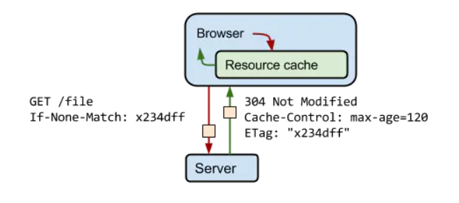

- 不要对变化的资源添加较短的max-age?
<!-- 文件之间的依赖可能会导致缓存的有效时间不一样 -->

- 不经常改变的文件  
  - 一般设置max-age=31536000（一年）
---
  
---
  

- 经常需要变动的文件
```text
Cache-Control: no-cache
```
  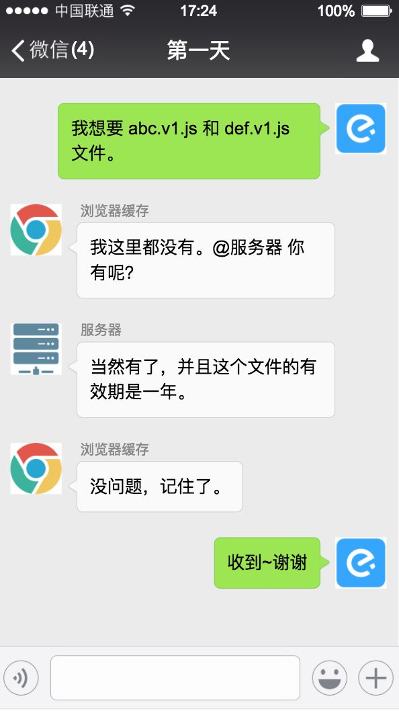
---
  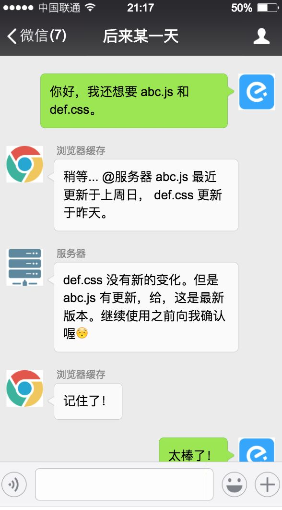

## 5. 加密传输
- 客户端和服务器是如何实现加密传输的？

背景：HTTP 是明文传输，信息在网络上裸奔。

#### 5.1 https原理
  ##### 5.1.1 plan A 使用对称密钥
---
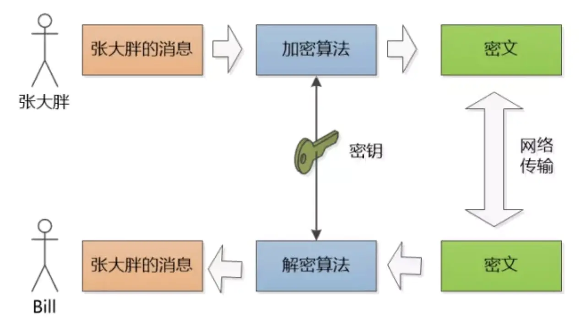

  ##### 5.1.2 plan B 使用非对称密钥
---


```text
RSA（非对称加密算法）：双方必须协商一对密钥，一个私钥一个公钥。
用私钥加密的数据，只有对应的公钥才能解密，用公钥加密的数据， 只有对应的私钥才能解密。
```


 ##### 5.1.3 plan C 非对称密钥+对称密钥
- 中间人攻击

```text
使用对称密钥的好处是速度比较快，使用非对称密钥的好处是可以使得传输的内容不能被破解，
因为就算你拦截到了数据，但是没有 Bill 的私钥，也是不能破解内容的。就比如说你抢了一个保险柜，
但是没有保险柜的钥匙也不能打开保险柜。所以我们要结合两者的优点。使用 RSA 的方法将加密算法的对称密钥发送过去，
之后就可以使用使用这个密钥，利用对称密钥来通信了。就比如说我将钥匙放进了保险柜，然后将保险柜寄给对方。
```

 ##### 5.1.4 确认身份 —— 数字证书

###### 数字签名


###### 数字证书  

---

###### 对比消息摘要  


###### 打开window系统证书
```text
 window键 + R打开cmd， 输入certlm.msc，如下图：
```


###### 远程桌面和VPN证书


**参考文档如下：**
- [你应该知道的前端——缓存][1]
- [谈谈 HTTPS][2]
- [HTTP 缓存机制一二三][3]


[1]: https://juejin.cn/post/6844903598556446733
[2]: https://juejin.cn/post/6844903504046211079
[3]: https://zhuanlan.zhihu.com/p/29750583